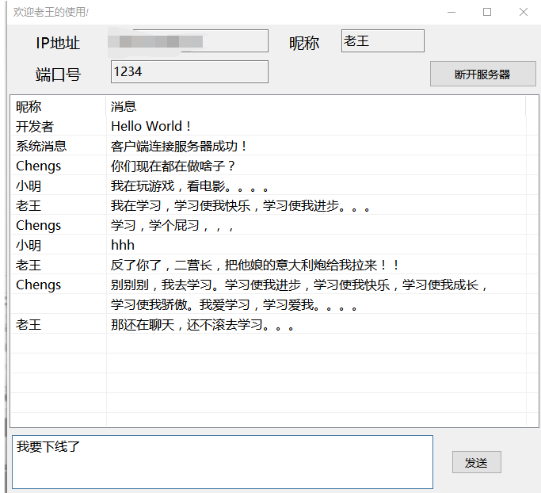

# Chatroom
这是一个基于Socket实现的简单多人聊天室，其中客户端用C#实现，服务器端用C++实现。

## 客户端展示

## 配置过程
1. 修改ChatRoom_Server.cpp文件中的端口号，并将此文件在你的linux服务器上编译运行;
2. 在windows中运行Chengs.Chatroom.exe，输入服务器IP地址、对应端口号及昵称即可开始聊天;

## 注意事项
1. 此程序不保持消息，也不过滤消息，当且仅当“当前连接服务器的所有用户”都能接受和发送消息;
2. 部署服务器时，最好将之中加入开机启动或者加入&后台运行；
3. 所有聊天记录可以在服务器的日志文件中查看.

